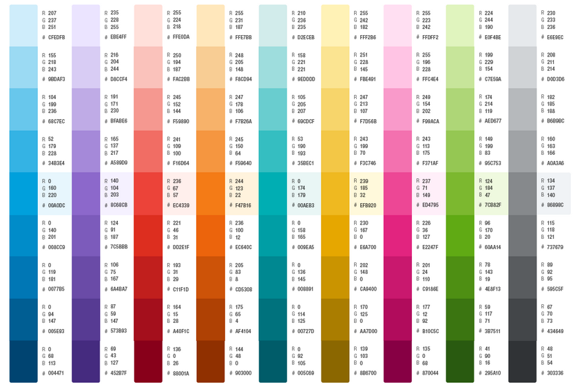

# fcoo-maps-colors
> JS, css, and SCSS mixins defining the colors and color-system for marker, lines etc. in [FCOO/fcoo-maps](https://github.com/FCOO/fcoo-maps)

## Description

Based on the Color Palettes defined in [FCOO/fcoo-colors](https://github.com/FCOO/fcoo-colors) this packages defines (almost) all the colors used in the different `fcoo-map-LAYER` packages setting up the different layers

It defines a number of SCSS and JC color-variables for different type of layer, provides a number of SCSS mixins to create css-classes, and create css for many of the layers available to [FCOO/fcoo-maps](https://github.com/FCOO/fcoo-maps)

## Installation
### bower
`bower install https://github.com/FCOO/fcoo-maps-colors.git --save`

<!--
## Demo
[http://FCOO.github.io/fcoo-maps-colors/demo/](http://FCOO.github.io/fcoo-maps-colors/demo/)
-->

## Colors

The general idea is to use each color-group to a specific group of layers. Different layers within a group can have different gradients of the same color

### Color-groups and scss-variables

There are 9 color-groups:

    0:Blue 1:Purple  2:Red  3:Orange  4:Cyan  5:Yellow  6:Pink  7:Green  8:Gray

Each color-group comes in 9 different gradients (0-9). 
The standard gradient for all color-groups is 4, but some for some purposes a different gradient is used 

#### Syntax
Below is a overview of the use of and scss-variables for each color-group.

The syntax is `$VARIABLE_NAME: COLOR-NAME[DELTA-GRADIENT]`

Where `COLOR-NAME` are one of the color-groups and `DELTA-GRADIENT` (optional) is +/- 1-3

Eq.

    $the-name-of-a-color: Yellow+1;
Means that `$the-name-of-a-color` has the value `#E6A700`

#### SCSS-variables
The 'global' scss-variables are defined in

    src/_fcoo-maps-colors-variables.scss

### Colors
### 0:Blue (TODO)

###1:Purple (TODO)

### 2:Red (TODO)

### 3:Orange = Search result in fcoo-maps

    $search-result-color: Orange+1; //Darker orange

### 4:Cyan (TODO)

### 5:Yellow = Observations (sea level, current, wind etc.) (`src/_fcoo-maps-colors-observations.scss`)

    $observations-color: Yellow;

### 6:Pink = Navigation and Niord (`src/_fcoo-maps-colors-niord.scss`)
Routs, EEZ, Firing warnings, NtM, NavWarn etc.

    //Standard "pink" for navigation-lines and areas in charts
    $navigation-pink:  #E5238C;

    //$navigation-purple = Used by Danish Maritime Authority as
    //standard color for Notices to Mariners, navigational and shooting warnings
    $navigation-purple: #E2007A;

### 7:Green = Harbors, Bridges, Towns, Hamlets, and Stations (`src\_fcoo-maps-colors-havnelods.scss`)
Colors for harbors etc. in Denmark and Greenland

    $harbor-dk-color: Green;
    $harbor-gl-color: Green+1;

### 8:Gray (TODO)

## JavaScript

The following variables are defined in ns `window.fcoo.color`

        window.fcoo.color.colorNames = //{id}{da:STRING, en:STRING}
            blue    : {da: 'blå',    en: 'blue'     },
            purple  : {da: 'lilla',  en: 'purple'   },
            red     : {da: 'rød',    en: 'red'      },
            orange  : {da: 'orange', en: 'orange'   },
            cyan    : {da: 'cyan',   en: 'cyan'     },
            yellow  : {da: 'Gul',    en: 'yellow'   },
            pink    : {da: 'pink',   en: 'pink'     },
            green   : {da: 'grøn',   en: 'green'    },
            gray    : {da: 'grå',    en: 'gray'     }
        };

    window.fcoo.color.colorList  = [ //[]{id, name: {da:STRING, en:STRING}} ordred window.fcoo.color.defaultOrder
        {id: 'blue', name: {da: 'blå', en: 'blue' }},
        {id: 'red',  name: {da: 'rød', en: 'red'  }},
        ...
    ]

<!--
### options
| Id | Type | Default | Description |
| :--: | :--: | :-----: | --- |
| options1 | boolean | true | If <code>true</code> the ... |
| options2 | string | null | Contain the ... |

### Methods

    .methods1( arg1, arg2,...): Do something
    .methods2( arg1, arg2,...): Do something else

-->

## Copyright and License
This plugin is licensed under the [MIT license](https://github.com/FCOO/fcoo-maps-colors/LICENSE).

Copyright (c) 2021 [FCOO](https://github.com/FCOO)

## Contact information

Niels Holt nho@fcoo.dk
